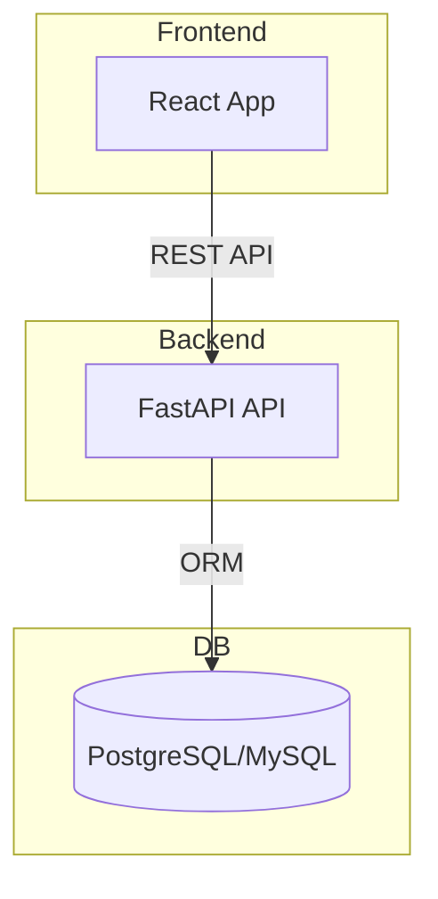

# Documento de Entregables del Proyecto
**Sistema de Gestión Empresarial (SaaS y Offline)**

---

## Introducción

Este documento detalla exhaustivamente todos los entregables del proyecto "Sistema de Gestión Empresarial", abarcando código fuente, manual de usuario, documentación técnica, diagramas, scripts, recursos adicionales y anexos. Se incluyen ejemplos de uso, fragmentos de código, comandos y buenas prácticas para facilitar la instalación, uso, despliegue y mantenimiento del sistema.

---

## 1. Código Fuente

### 1.1 Frontend (React) [SOLO WEB/SAAS]
- **Ubicación:** `/frontend_saas/`
- **Tecnologías:** React 19+, Material UI, Chart.js, Axios, dayjs
- **Estructura:**
  - `src/pages/`: Páginas principales (Dashboard, Ventas, Reportes, etc.)
  - `src/components/`: Componentes visuales y de layout (ej. `MainLayout.tsx`)
  - `src/services/`: Servicios para comunicación con la API.
  - `src/context/`: Contextos globales (ej. autenticación).
  - `src/routes/`: Rutas protegidas y públicas.
  - `public/`: Recursos estáticos e imágenes.
  - `package.json`, `package-lock.json`: Dependencias y scripts.
- **Características clave:**
  - Interfaz moderna, responsive y accesible.
  - Control de roles: admin, vendedor, inventario.
  - Gráficos interactivos (barras y torta) en reportes.
  - Filtros de fechas precisos con dayjs.
  - Rutas protegidas según permisos.
  - Ejemplo de uso de roles en menú:
    ```tsx
    // src/components/MainLayout.tsx
    const getMenuItems = () => {
      // ...
      if (user.rol === 'vendedor') {
        return allMenuItems.filter(item =>
          !item.adminOnly ||
          item.text === 'Ventas' ||
          item.text === 'Clientes' ||
          item.text === 'Reportes'
        );
      }
      // ...
    }
    ```
  - Ejemplo de comando para instalar dependencias:
    ```sh
    cd frontend_saas
    npm install
    npm start
    ```

### 1.2 Backend (FastAPI) [SOLO WEB/SAAS]
- **Ubicación:** `/backend_saas/`
- **Tecnologías:** Python 3.10+, FastAPI, SQLAlchemy, Pydantic, Uvicorn, PostgreSQL/MySQL
- **Estructura:**
  - `app/api/`: Endpoints REST (productos, ventas, reportes, etc.)
  - `app/models/`: Modelos ORM y relaciones.
  - `app/schemas/`: Esquemas de validación (Pydantic).
  - `main.py`: Punto de entrada de la API.
  - `requirements.txt`: Dependencias.
  - `render.yaml`, `Dockerfile`: Despliegue automatizado.
- **Características clave:**
  - Autenticación JWT y control de roles.
  - Endpoints protegidos y validados.
  - Reportes avanzados: ventas por día, por categoría, etc.
  - Ejemplo de endpoint protegido:
    ```python
    # app/api/ventas.py
    @router.get("/ventas/agrupadas-por-categoria")
    def ventas_por_categoria(..., current_user: Usuario = Depends(get_current_user)):
        if current_user.rol not in ["admin", "vendedor"]:
            raise HTTPException(status_code=403, detail="No autorizado")
        # ... lógica ...
    ```
  - Ejemplo de comando para iniciar el backend:
    ```sh
    cd backend_saas
    pip install -r requirements.txt
    uvicorn main:app --reload
    ```

### 1.3 Sistema Offline (Tkinter) [SOLO OFFLINE]
- **Ubicación:** `/sistema_gestion_mejorado_modulos/`
- **Tecnologías:** Python 3.x, Tkinter, MySQL-connector, SQLite, Pillow
- **Estructura:**
  - `main.py`, `main_offline.py`: Puntos de entrada.
  - `modulo_*`: Módulos funcionales (inventario, ventas, reportes, configuración, autenticación).
  - `estilos.py`: Temas claro/oscuro.
  - `README.md`: Manual de uso offline.
- **Características clave:**
  - Interfaz gráfica de escritorio.
  - Soporte para modo claro/oscuro.
  - Gestión modular por roles.
  - Ejemplo de ejecución:
    ```sh
    cd sistema_gestion_mejorado_modulos
    python main.py
    ```

---

## 2. Manual de Usuario

- Las instrucciones de instalación y uso están divididas según modalidad:
  - [SOLO WEB/SAAS]: Instalación y uso de frontend y backend web.
  - [SOLO OFFLINE]: Instalación y uso del sistema de escritorio.
  - [AMBOS]: Flujos de trabajo, roles y módulos aplican a ambas versiones, salvo donde se indique lo contrario.

### 2.1 Instalación y Primeros Pasos

#### Requisitos Generales
- Python 3.10+
- Node.js 18+
- npm 9+
- MySQL o PostgreSQL

#### Instalación Backend
```sh
cd backend_saas
pip install -r requirements.txt
uvicorn main:app --reload
```

#### Instalación Frontend
```sh
cd frontend_saas
npm install
npm start
```

#### Instalación Sistema Offline
```sh
cd sistema_gestion_mejorado_modulos
pip install -r requirements.txt
python main.py
```

### 2.2 Inicio de Sesión y Roles
- Accede con tu usuario y contraseña.
- El sistema detecta tu rol y muestra solo las funciones permitidas:
  - **admin:** Acceso total.
  - **vendedor:** Ventas, Clientes, Reportes.
  - **inventario:** Inventario, Reportes.

### 2.3 Flujos de Trabajo

#### Gestión de Productos (Inventario)
- Agrega, edita, elimina y consulta productos.
- Visualiza alertas de stock bajo.

#### Gestión de Ventas
- Registra ventas, selecciona productos y clientes.
- Consulta ventas recientes y detalles.

#### Reportes
- Genera reportes de ventas y productos vendidos por periodo.
- Visualiza gráficos de barras y torta.
- Filtra por fechas exactas usando el selector de fechas.

#### Configuración
- Cambia datos de la empresa, nivel de alerta de stock y tema visual (solo admin).
- Realiza respaldos y restauraciones.

### 2.4 Consejos y Buenas Prácticas
- Utiliza siempre el logout para cerrar sesión.
- Revisa el manual de usuario (este documento y los README).
- Consulta la documentación técnica para detalles avanzados.
- Realiza respaldos periódicos usando los scripts y utilidades provistos.

---

## 3. Documentación Técnica

### 3.1 Arquitectura General
- **Backend SaaS:** API RESTful FastAPI, lógica de negocio, persistencia multiempresa.
- **Frontend SaaS:** React, Material UI, gráficos, rutas protegidas.
- **Offline:** Tkinter, SQLite/MySQL, sincronización local/nube.

#### Diagrama de arquitectura (Mermaid):


### 3.2 Estructura de Carpetas
- Ver archivo `INDICE_PROYECTO.md` para un desglose completo.

### 3.3 Dependencias y Validación
- **Backend:** FastAPI, SQLAlchemy, Pydantic, JWT, etc.
- **Frontend:** React, MUI, Chart.js, dayjs, etc.
- **Offline:** Tkinter, MySQL-connector, Pillow.

### 3.4 Endpoints y Modelos
- Documentados en `DOCUMENTACION_COMPLETA_SISTEMA_SAAS.md` y PDF.
- Ejemplo de endpoint:
  ```http
  GET /ventas/agrupadas-por-dia
  Authorization: Bearer <token>
  ```
- Ejemplo de modelo:
  ```python
  class Producto(Base):
      __tablename__ = "productos"
      id = Column(Integer, primary_key=True)
      nombre = Column(String)
      stock = Column(Integer)
      # ...
  ```

### 3.5 Pruebas y Validaciones
- Pruebas manuales y automáticas de endpoints y flujos críticos.
- Uso de Postman, frontend y scripts para validar la API.
- Pruebas multiempresa y de roles.

### 3.6 Despliegue
- **Backend:** Render, Railway, VPS propio.
- **Frontend:** Vercel, Netlify, servidor propio.
- **Variables de entorno:** `.env` para backend y frontend.

---

## 4. Diagramas

A continuación se presentan varios diagramas visuales (ASCII art) para facilitar la comprensión de la arquitectura, módulos, roles y flujos principales del sistema.

### 4.1 Arquitectura General [AMBOS]
```
+-------------------+    HTTP/API   +-------------------+
| Frontend (Web)    |<------------->| Backend (API)     |
| React + MUI       |               | FastAPI (Python)  |
+-------------------+               +-------------------+
        |                                   |
        v                                   v
+-------------------+               +-------------------+
| Sistema Offline   |               | Base de Datos     |
| Tkinter (Python)  |               | PostgreSQL/MySQL  |
| SQLite/MySQL      |               +-------------------+
+-------------------+
```
**Leyenda:**
- El frontend web se comunica con el backend vía HTTP/REST.
- El backend accede a la base de datos.
- El sistema offline puede operar con base local o conectarse a la nube.

---

### 4.2 Módulos Principales del Sistema [AMBOS]
```
+------------+   +----------+   +---------+
| Dashboard  |-->| Ventas   |-->| Clientes|
+------------+   +----------+   +---------+
      |               |              |
      v               v              v
+----------+   +----------+   +---------+
|Inventario|   |Reportes  |   |Usuarios |
+----------+   +----------+   +---------+
      |
      v
+--------------+
|Configuración |
+--------------+
```
**Leyenda:**
- Flechas indican relación y acceso entre módulos.
- Dashboard es el punto de entrada y resumen.
- Inventario, Ventas y Clientes son módulos operativos principales.
- Reportes y Usuarios dependen de la información generada.
- Configuración permite ajustes globales y de empresa.

---

### 4.3 Flujo de Roles y Permisos [AMBOS]
```
+-------------------+
|    Usuario        |
+-------------------+
         |
         v
+-------------------+
|   Login/Registro  |
+-------------------+
         |
         v
+-------------------+
|   ¿Rol?           |
+-------------------+
   |     |      |
   v     v      v
Admin Vendedor Inventario
 |      |         |
 v      v         v
Acceso a módulos según permisos:

Admin:      Dashboard, Inventario, Ventas, Clientes, Reportes, Usuarios, Configuración
Vendedor:   Dashboard, Inventario, Ventas, Clientes, Reportes
Inventario: Dashboard, Inventario, Reportes
```
- Admin: Dashboard, Inventario, Ventas, Clientes, Reportes, Usuarios, Configuración
- Vendedor: Dashboard, Inventario, Ventas, Clientes, Reportes
- Inventario: Dashboard, Inventario, Reportes

---

### 4.4 Flujo de Ventas y Reportes [AMBOS]
```
+-------------------+
|   Nueva Venta     |
+-------------------+
         |
         v
+-------------------+
| Selección Cliente |
+-------------------+
         |
         v
+-------------------+
| Selección Productos|
+-------------------+
         |
         v
+-------------------+
| Confirmar y Guardar|
+-------------------+
         |
         v
+-------------------+
|   Actualizar Stock |
+-------------------+
         |
         v
+-------------------+
|   Generar Reporte  |
+-------------------+
         |
         v
+-------------------+
|   Visualizar Gráficos|
+-------------------+
```
**Leyenda:**
- El flujo inicia con una nueva venta, seleccionando cliente y productos.
- Al confirmar, se actualiza el stock y se genera un registro de venta.
- Los reportes y gráficos se alimentan de las ventas registradas.

---

### 4.5 Arquitectura Multiempresa (SaaS) [SOLO WEB/SAAS]
```
+-------------------+         +-------------------+         +-------------------+
|   Empresa A       |         |   Empresa B       |         |   Empresa C       |
+-------------------+         +-------------------+         +-------------------+
        |                           |                              |
        v                           v                              v
+-------------------+      +-------------------+         +-------------------+
| Usuarios A        |      | Usuarios B        |         | Usuarios C        |
| Productos A       |      | Productos B       |         | Productos C       |
| Ventas A          |      | Ventas B          |         | Ventas C          |
| Reportes A        |      | Reportes B        |         | Reportes C        |
+-------------------+      +-------------------+         +-------------------+
        |                           |                              |
        +-----------+---------------+--------------+---------------+
                                    |
                                    v
                        +--------------------------+
                        |   Backend/API SaaS       |
                        |   (Aísla datos por       |
                        |    empresa y usuario)    |
                        +--------------------------+
                                    |
                                    v
                        +--------------------------+
                        |   Base de Datos          |
                        |   (Tablas con campo      |
                        |    empresa_id para       |
                        |    separar datos)        |
                        +--------------------------+
```
**Leyenda:**
- Cada empresa tiene sus propios usuarios, productos, ventas y reportes.
- El backend aísla los datos usando el identificador de empresa (`empresa_id`).
- Los usuarios solo pueden acceder a los datos de su empresa.
- La base de datos almacena todo, pero cada registro está vinculado a una empresa.

---

### 4.6 Flujo de Registro y Autenticación Multiempresa [SOLO WEB/SAAS]
```
+-------------------+
|   Registro        |
+-------------------+
        |
        v
+-------------------+
|  Crear Empresa    |
+-------------------+
        |
        v
+-------------------+
|  Crear Usuario    |
+-------------------+
        |
        v
+-------------------+
|  Login            |
+-------------------+
        |
        v
+-------------------+
|  Validar Empresa  |
+-------------------+
        |
        v
+-------------------+
|  Validar Usuario  |
+-------------------+
        |
        v
+-------------------+
|  Acceso a Sistema |
+-------------------+
```
**Leyenda:**
- El flujo inicia con el registro de una nueva empresa y su primer usuario (admin).
- El login valida empresa y usuario antes de permitir el acceso.
- Cada usuario queda vinculado a una empresa específica.

---

### 4.7 Sincronización Offline/Online [INTEGRACIÓN OFFLINE + WEB/SAAS]
```
+-------------------+           +-------------------+
| Sistema Offline   |           |   Backend SaaS    |
| Tkinter + SQLite |           |   FastAPI + DB    |
+-------------------+           +-------------------+
        |                                 ^
        | Sincronizar (cuando hay         |
        | conexión a internet)            |
        +------------------------------->|
        |                                |
        |<-------------------------------+
        |   Descargar/actualizar datos   |
        v                                |
+-------------------+                    |
|  Base de Datos    |<-------------------+
|  Local (SQLite)   |   Replicación      |
+-------------------+   selectiva        |
```
**Leyenda:**
- El sistema offline opera con base local (SQLite).
- Cuando hay conexión, puede sincronizar datos con el backend SaaS.
- La sincronización puede ser bidireccional (subida y bajada de datos).
- Permite trabajar sin conexión y actualizar cuando sea posible.

---

### 4.8 Interacción entre Módulos (Ejemplo: Proceso de Venta) [AMBOS]
```
Inventario -> Ventas -> Clientes -> Reportes -> Configuración
   |           |         |           |             |
Verificar   Registrar  Seleccionar  Generar     Ajustar
stock       venta      cliente      informe     parámetros
```
**Leyenda:**
- El proceso de venta involucra varios módulos en secuencia.
- Cada módulo puede interactuar con los demás según el flujo de trabajo.
- Configuración permite ajustar parámetros globales que afectan a todos los módulos.

---

## 5. Scripts y Recursos Adicionales

### 5.1 Scripts SQL
- **Archivo principal:** `/SQL/respaldo_railway.sql`
- **Otros scripts:** `/scripts_utiles/script_alter_fechas.sql`, `/scripts_utiles/script_migracion_multitenant.sql`

### 5.2 Scripts Python
- **Generar hashes bcrypt:** `/scripts_utiles/generar_hashes_bcrypt.py`
- **Keep alive backend:** `/scripts_utiles/keep_alive.py`

### 5.3 Archivos Comprimidos
- **Proyecto completo:** `/archivos_compresos/proyecto_completo_funcional.zip`
- **Sistema modular:** `/archivos_compresos/sistema_gestion_mejorado_modulos.rar`

### 5.4 Índice del Proyecto
- **Archivo:** `/INDICE_PROYECTO.md`
- **Descripción:** Guía de estructura y archivos.

---

## 6. Entregables (formato ficha)

**Código fuente frontend**  
- Descripción: Aplicación React. Incluye dependencias y recursos.  
- Ubicación/Archivo: `/frontend_saas/`  
- Observaciones: [SOLO WEB/SAAS]

**Código fuente backend**  
- Descripción: API FastAPI. Incluye scripts de migración.  
- Ubicación/Archivo: `/backend_saas/`  
- Observaciones: [SOLO WEB/SAAS]

**Sistema offline**  
- Descripción: App de escritorio Tkinter. Manual incluido en README.  
- Ubicación/Archivo: `/sistema_gestion_mejorado_modulos/`  
- Observaciones: [SOLO OFFLINE]

**Manual de usuario**  
- Descripción: Instrucciones y flujos de uso. Basado en README y documentación.  
- Ubicación/Archivo: Este documento y README.md  
- Observaciones: [AMBOS]

**Documentación técnica**  
- Descripción: Arquitectura, endpoints, diagramas, etc. Incluye diagramas Mermaid.  
- Ubicación/Archivo: `/documentacion/DOCUMENTACION_COMPLETA_SISTEMA_SAAS.pdf`  
- Observaciones: [AMBOS]

**Diagramas**  
- Descripción: Diagramas de arquitectura y despliegue. Formato Mermaid/Markdown.  
- Ubicación/Archivo: `/diagramas/`  
- Observaciones: [AMBOS]

**Script de base de datos**  
- Descripción: SQL para crear y poblar la base de datos. Compatible con Railway/Postgres.  
- Ubicación/Archivo: `/SQL/respaldo_railway.sql`  
- Observaciones: [AMBOS]

**Scripts utilitarios**  
- Descripción: Scripts Python y SQL adicionales. Hashes, migraciones, keep-alive.  
- Ubicación/Archivo: `/scripts_utiles/`  
- Observaciones: [AMBOS]

**Archivos comprimidos**  
- Descripción: Proyecto listo para entregar. Incluye todo el contenido.  
- Ubicación/Archivo: `/archivos_compresos/`  
- Observaciones: [AMBOS]

**Informe final**  
- Descripción: Memoria o informe del proyecto. Versión PDF actualizada.  
- Ubicación/Archivo: `/documentacion/INFORME_PROYECTO_SISTEMA_SAAS.pdf`  
- Observaciones: [AMBOS]

**Índice del proyecto**  
- Descripción: Estructura y guía de archivos/carpetas. Facilita la revisión.  
- Ubicación/Archivo: `/INDICE_PROYECTO.md`  
- Observaciones: [AMBOS]

---

## 7. Anexos y Observaciones Finales

- Todos los archivos y carpetas están organizados según el índice del proyecto.
- Los diagramas pueden visualizarse en los archivos `.md` (Mermaid) o como imágenes si están disponibles.
- El archivo comprimido incluye todo el código, documentación y recursos necesarios para la ejecución y revisión del proyecto.
- Se recomienda revisar el manual de usuario antes de la instalación y uso del sistema.
- Para dudas técnicas, consultar la documentación técnica y los comentarios en el código fuente.
- Para restaurar la base de datos, usar el script SQL provisto.
- Para soporte adicional, contactar al desarrollador o consultar los README.

---

## 8. Comparativa: Modo Web/SaaS vs Offline vs Integración

- **Interfaz de usuario:**
  - Web/SaaS: Web moderna, responsive
  - Offline: Escritorio clásica
  - Integración: Módulos equivalentes

- **Acceso:**
  - Web/SaaS: Navegador web, acceso global
  - Offline: PC local, sin internet
  - Integración: Sincronización cuando hay conexión

- **Base de datos:**
  - Web/SaaS: PostgreSQL/MySQL en la nube
  - Offline: SQLite/MySQL local
  - Integración: Replicación y migración de datos

- **Multiempresa:**
  - Web/SaaS: Sí, aislamiento total
  - Offline: No, una empresa por instalación
  - Integración: Sincronización por empresa

- **Autenticación:**
  - Web/SaaS: JWT, roles, multiusuario
  - Offline: Login local, roles
  - Integración: Validación cruzada en sincronización

- **Reportes y gráficos:**
  - Web/SaaS: Gráficos avanzados (Chart.js)
  - Offline: Reportes básicos, tablas
  - Integración: Exportación y visualización cruzada

- **Actualizaciones:**
  - Web/SaaS: Despliegue continuo (Vercel, Railway)
  - Offline: Manual, por usuario
  - Integración: Scripts de migración y backup

- **Respaldo y restauración:**
  - Web/SaaS: Scripts SQL, backups automáticos
  - Offline: Respaldos manuales
  - Integración: Importación/exportación de datos

- **Configuración:**
  - Web/SaaS: Panel web, multiempresa
  - Offline: Ventana de configuración local
  - Integración: Parámetros sincronizables

- **Soporte de roles:**
  - Web/SaaS: Admin, vendedor, inventario
  - Offline: Admin, vendedor, inventario
  - Integración: Permisos equivalentes

- **Desempeño:**
  - Web/SaaS: Escalable, multiusuario
  - Offline: Rápido en local, un usuario
  - Integración: Migración a SaaS sin perder datos

- **Despliegue:**
  - Web/SaaS: Vercel, Railway, Render, VPS
  - Offline: Windows/Linux/Mac (Python)
  - Integración: Documentación para ambos entornos

---

## 9. Sugerencias de Uso y Mejores Prácticas

- **Para empresas con sucursales:**  
  Usa el modo SaaS para centralizar datos y el modo offline para puntos de venta sin conexión. Sincroniza ventas y stock al final del día.

- **Para migrar de offline a SaaS:**  
  Utiliza los scripts de exportación/importación y la sincronización para no perder información histórica.

- **Para desarrolladores:**  
  Aprovecha la estructura modular para crear nuevos módulos (por ejemplo, compras, proveedores) y mantener la compatibilidad entre ambos modos.

- **Para administradores:**  
  Realiza respaldos periódicos y revisa los logs de sincronización para asegurar la integridad de los datos.

---

## 10. Ejemplo de Escenario Real

1. **Una empresa inicia usando el sistema offline** en una sucursal sin internet.  
2. Cuando obtiene conexión, **sincroniza los datos** con la nube y comienza a usar el sistema web para reportes y administración centralizada.
3. **Los vendedores pueden seguir usando el sistema offline** en caso de cortes de internet, y los datos se sincronizan automáticamente cuando la conexión vuelve.
4. **El administrador puede ver reportes globales** y tomar decisiones en tiempo real desde cualquier lugar.

---

## 11. Frase Final Inspiradora

> “Un sistema robusto no es solo el que funciona en la nube, sino el que nunca te deja sin tus datos, estés donde estés.”

---

**Fin del documento de entregables.** 